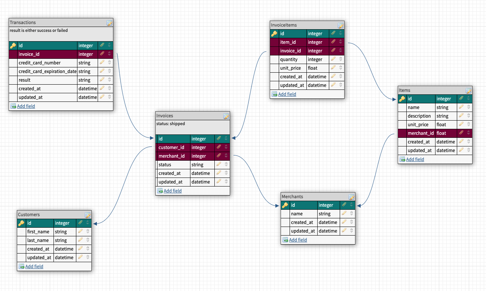

# Rails Engine

## About this Project
Rails Engine is a project that exposes data that powers a mock E-Commerce Application site through an API that the front end will consume using service-oriented architecture for building the API.

## Table of Contents

  - [Getting Started](#getting-started)
  - [Running the tests](#running-the-tests)
  - [DB Schema](#db-schema)
  - [Endpoints](#endpoints)
  - [Built With](#built-with)
  - [Versioning](#versioning)
  - [Authors](#authors)

## Getting Started

To run the web application on your local machine, you can fork and clone down the repo and follow the installation instructions below.

### Installing

- Install the gem packages  
`bundle install`

- Create the database by running the following command in your terminal
`rails db{:drop,:create,:migrate,:seed}`

### Prerequisites

To run this application you will need Ruby 2.5.3 and Rails 5.2.5

## Running the tests
RSpec testing suite is utilized for testing this application.
- Run the RSpec suite to ensure everything is passing as expected  
`bundle exec rspec`

Postman can also be used for testing by following the instructions found 

## DB Schema
The following is a depiction of our Database Schema

 

## API Endpoints
- `GET /api/v1/merchants` Get all Merchants
  - `GET /api/v1/merchants?per_page=50&page=2` Get all Merchants with quantity per page and/or page number.
- `GET /api/v1/items` Get all Items
  - `GET /api/v1/items?per_page=50&page=2` Get all Items with quantity per page and/or page number.
- `GET /api/v1/merchant/:id` get one Merchant
- `GET /api/v1/item/:id` get one Item
- `GET /api/v1/merchants/find?name=<query>` Find one Merchant based on name search
- `GET /api/v1/items/find_all?name=<query>` Find all Items based on name search
- `GET /api/v1/merchants/:id/items` Get all Items for a given Merchant ID
- `POST /api/v1/items` Create an Item
- `DELETE /api/v1/items/:id` Delete an Item
- `PATCH /api/v1/items/:id` Edit an Item
- `GET /api/v1/items/:id/merchant` Get the Merchant data for a given Item ID
- `GET /api/v1/revenue/merchants?quantity=<x>` Find Merchants with the most revenue, where `x` is the number of Merchants to be returned
- `GET /api/v1/revenue/items?quantity=<x>` Find Items ranked by revenue, where `x` is the maximum count of results to return
- `GET /api/v1/revenue/merchants/:id` Get total revenue for a given Merchant
- `GET /api/v1/revenue/unshipped?quantity=<x>` Get potential revenue of unshipped orders ranked by potential revenue, where `x` is the maximum count of results to return

## Built With
- Ruby
- Rails
- RSpec

## Gems Used
- factory_bot_rails
- faker
- json
- fast_jsonapi

## Versioning
- Ruby 2.5.3
- Rails 5.2.5

## Authors
- **Gaelyn Cooper**
| [GitHub](https://github.com/gaelyn) |
  [LinkedIn](https://www.linkedin.com/in/gaelyn-cooper/)
